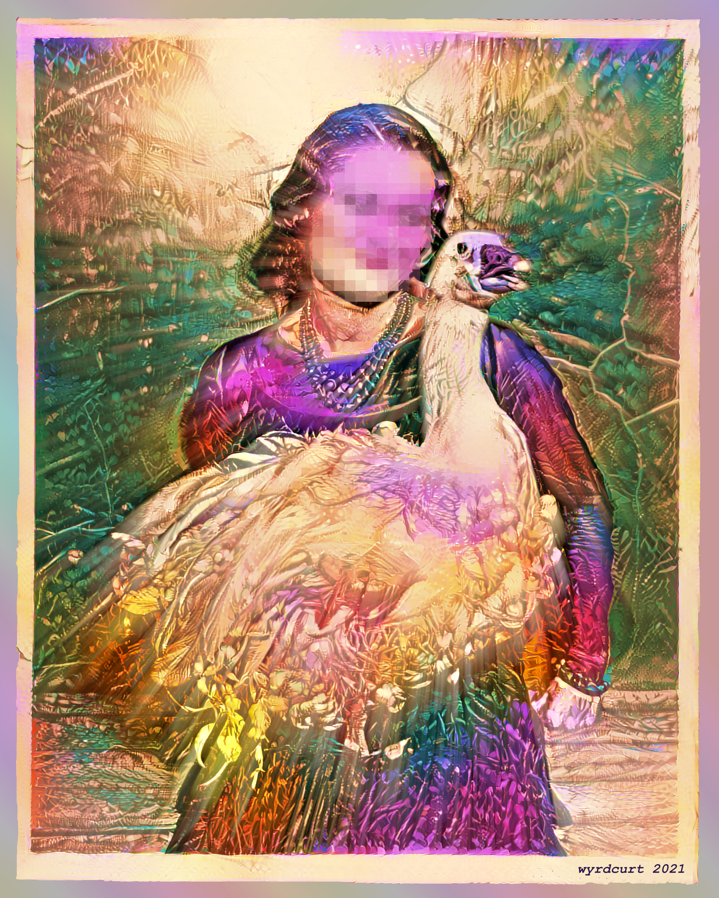
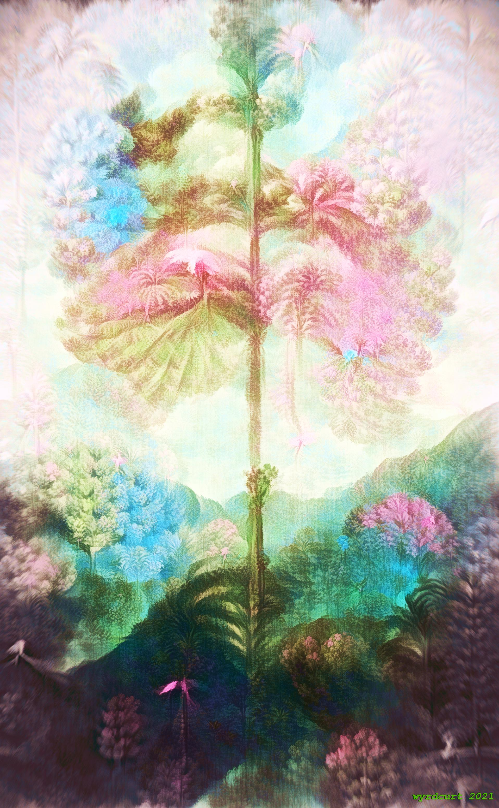
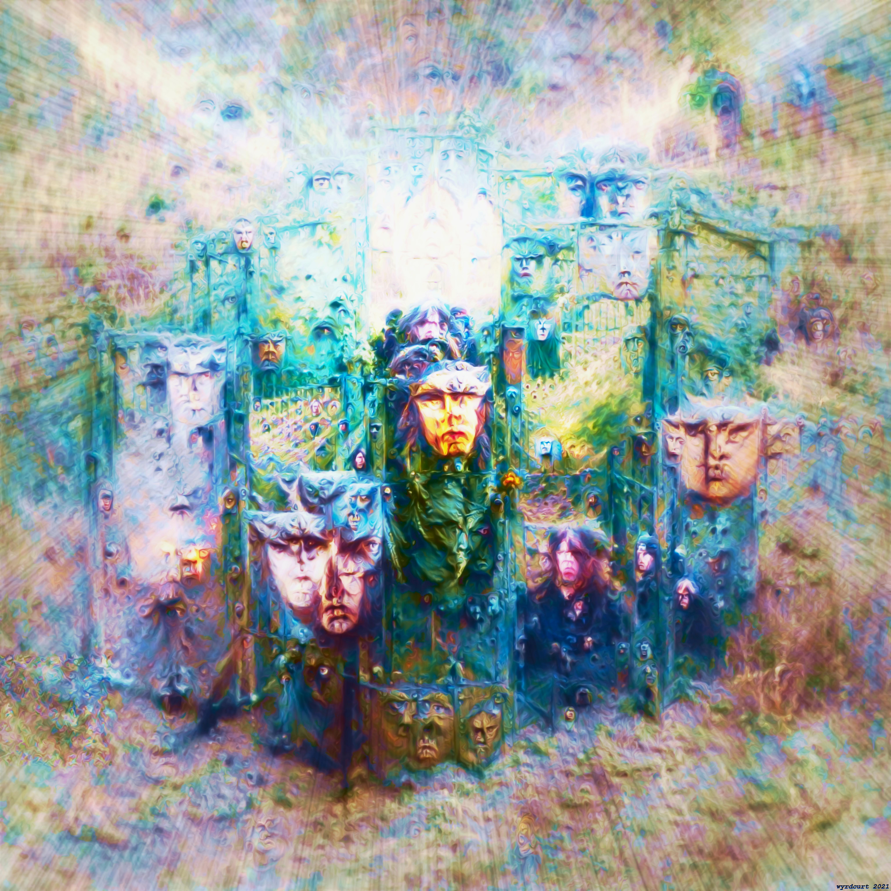
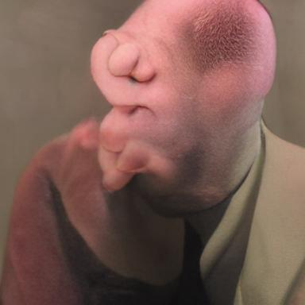
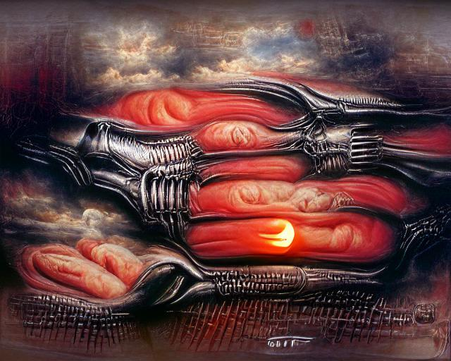
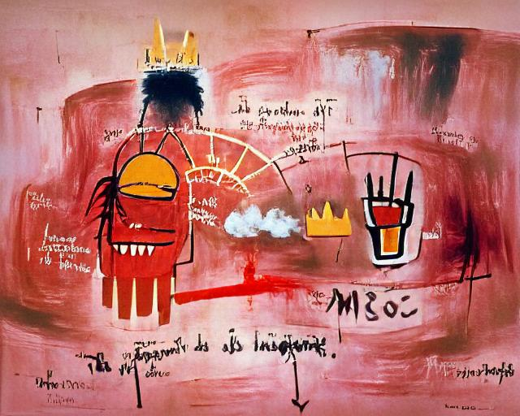
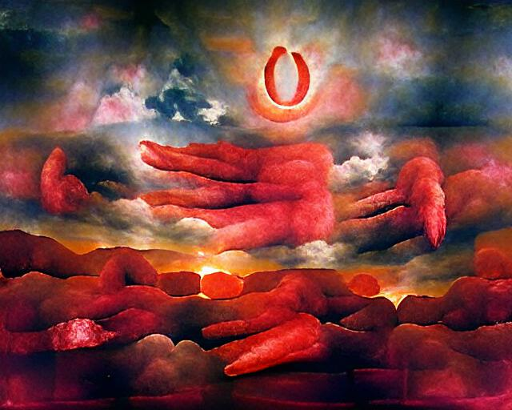
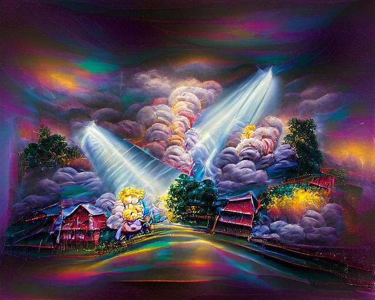
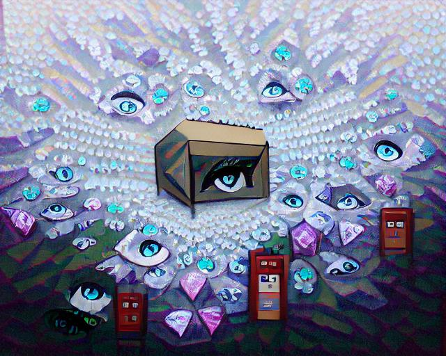

[About](./about.html) | **Gallery** | [Twitter](https://twitter.com/wyrdcurt) | [Facebook](https://www.facebook.com/wyrdcurt) | [Instagram](https://www.instagram.com/wyrdcurt/) | [Reddit](https://www.reddit.com/user/Wyrdcurt) | [GitHub](https://github.com/CurtisASmith)

## The Gallery

This is not an exhaustive portfolio by any means, only a collection of some of personal favorite creations of mine, listed in their general chronological order of creation.

**A New York Goose, 1930 (colorized).** The first piece I completed as Wyrdcurt. It's a public domain photo colorized and stylized with AI, then edited in GIMP.

___

**A Dream of _Mimosa pudica_.** A public domain illustration of a sensitive plant stylized with CLIP+FFT.

___

**A Divine Circuit** There's a 3D version of this [here on my Facebook page](https://www.facebook.com/wyrdcurt/posts/125941386243740)

___

**創作 [Creation]** A reminder of what I must do daily, but also a bit tongue-in-cheek (it's like stamping the word "ARTWORK" across a painting - might look cool if you don't know English). Both this and **Divine Circuit** were created with heavily-manipulated outputs from CLIP+FFT.

___

**Faces at the Gates** A CLIP+FFT output I really liked.

___

**Some strange CLIP output** It doesn't look like what I prompted it with but it's kinda neat.

___

**In the red sky of the sun, there are a thousand fingers of God, painting by [H. R. Giger / Thomas Kinkade / Jean-Michel Basquiat / Georgia O'Keefe]** Using the CLIP+VQGAN technique pioneered by Katherine Crowson. Four images, same parameters, similar prompts, only difference in each was the artist name. Should be very easy to tell which is which.

___

More to come.